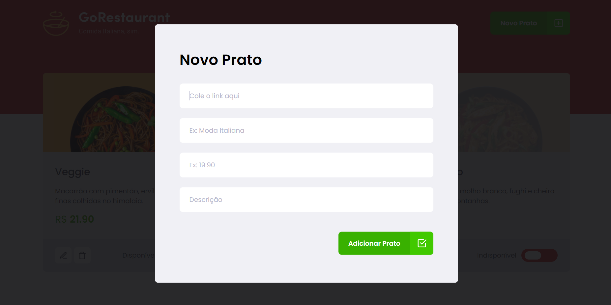

<p align="center">
   
</p>

<p align="center">
 <a href="#projeto">Projeto</a> •
 <a href="#tecnologias">Tecnologias Utilizadas</a> •
 <a href="#execucao">Como Executar</a> •
 <a href="#licenca">Licença</a> •
 <a href="#autor">Autor</a> •
 <a href="#contato">Contato</a> 
</p>

--------------------------- 

# :fire: <Strong>Obrigado por visualizar este repositório</Strong> 

<p align="justify">Olá, primeiramente me chamo Gabriel Kenji Poli Ozaki, tenho 21 anos e trabalho na área de Desenvolvedor Front-end.</p>

## :computer: <strong id="projeto">Sobre o Projeto</strong>



<p align="justify"><strong>GoRestaurant</strong> é um app voltado ao ser um <strong>cardápio de delivery</strong>, contendo o catálogo com as informações de cada prato.<p>

<p align="justify">Essa aplicação GoRestaurant foi desenvolvida, através do Bootcamp Ignite organizada pela empresa Rocketseat e mentoreado pelo Diego Fernandes na trilha de ReactJS.</p>

### :pushpin: Funcionabilidades

- [x] Exibir os pratos cadastrados em tela.
- [x] Adicionar novos pratos.
- [x] Apagar um prato cadastrado.
- [x] Alterar as informações dos pratos.

## :rocket: <Strong id="tecnologias">Tecnologias Utilizadas</Strong>

[](https://reactjs.org/) [](https://www.typescriptlang.org/) [](https://styled-components.com) [](https://axios-http.com/ptbr/)

## :runner: <strong id="execucao">Como executar o projeto</strong>

[](https://classic.yarnpkg.com/en/docs/install/#windows-stable)

```bash
# Faça o clone deste repositório:
>> git clone https://github.com/WD-GabrielKenji/IgniteReactJS-GoRestaurant.git

>> cd IgniteReactJS-GoRestaurant >> code .
```
```bash
# Para executar a aplicaçao é necessário:

## Instalar as dependencias: 
>> yarn

## Iniciar a API Fake:
>> yarn server

## Iniciar o servidor de desenvolvimento:
>> yarn start
```

<pre>Agora basta acessar <a href="http://localhost:3000" rel="nofollow"><code>localhost:3000</code></a> em seu Browser, e usufruir da aplicação.
 
Para verificar os dados da API Fake, acessar <a href="http://localhost:3333/foods" rel="nofollow"><code>localhost:3333/foods</code></a> em seu Browser.
</pre>

## :closed_book: <strong id="licenca">Licença</strong>


Esse projeto esta sob a licença MIT. Veja o arquivo [LICENSE](LICENSE) para mais detalhes.

## :boy: <strong id="autor">Autor</strong>

<a href="https://github.com/WD-GabrielKenji">
 
 <br />
 <sub><b>Gabriel Kenji Poli Ozaki</b></sub></a> <a href="https://github.com/WD-GabrielKenji" title="Perfil Github"> :star2: 
</a>


Feito de ❤️ por <strong>Gabriel Kenji Poli Ozaki</strong> - <strong>Desenvolvedor Front-end</strong> 👋🏽

### :mailbox_with_mail: <strong id="contato"> Redes Sociais para Contato: </strong>

<p> Entre em contato, atraves destas redes sociais: </p>

[](https://www.linkedin.com/in/wdkenji/)  [](https://www.instagram.com/biel.kenjii/)  [](mailto:g.kenjijs@gmail.com)

[](https://github.com/WD-GabrielKenji)
